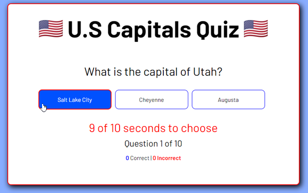

# United States Capitals Quiz

Test your knowledge of the 50 U.S State Capitals.

# HOW TO PLAY
## Visit the Github Page
Please visit the [United States Capitals Quiz](https://mauricechevez.github.io/US-CAPITALS-QUIZ/) page to play on your browser

### Gameplayer Screenshot


Player starts the quiz by clicking the start button. Player has 10 seconds to correctly guess each state capital. Player needs at least 60% or higher to recieve a passing score. There are 50 questions. 
## Score scale
| Score      | Description |
| ----------- | ----------- |
|Less than 50%    |     Fail   |
|51% to 59%       | 1 Eagle     |
|60% to 69%       | 2 Eagles    |
|70% to 79%       | 3 Eagles     |
|80% to 89%       | 4 Eagles     |
|90% to 100%       | 5 Eagles     |

### Eagle Pictures
| Fail | Pass |
| ----------- | ----------- |
| | | 

### Passing and Failing screenshots
  | 

## Start Up Screen:
Player will click the "Start the Quiz" button to begin.


# HOW TO INSTALL

1. *`Fork`* and *`Clone`* this respository to your local machine
2. Open `index.html` in your browser to play or 
3. Open the directory in your text editor of choice to view or edit the code

# HOW IT WORKS

## Questions, Choices and Answers
The questions are stored in an array. Each state, with the choices and answers are stored in their own objects within the array
```javascript
{question: 'What is the capital of California?', capital1:'Trenton', capital2:'Santa Fe',capital3:'Sacramento',answer:'Sacramento',}
```

## Score Tracking
Each time a player clicks a selection, an event listner is set to grab the textContent of the element (in this case, a DIV) and passes that value to a paramter. The following function then uses **IF** statements to check whether the textContent matches what the answer is. This same function also checks if it has reached the last object in the array of questions, then presents the player with their score.
```javascript
function checkAnswer(clickedAnswer){
    if (clickedAnswer == stateQuestions[currentQuestionIndex].answer){
        console.log('Correct!')
        score++
        questionNumber++
    } else {
        console.log('Incorrect')
    } 
    count = 0
    if (currentQuestionIndex < finalQuestionIndex){
        currentQuestionIndex++
        renderQuestion()
    } else{
        console.log('Quiz over!')
        gameOverScreen()
        clearInterval(timer)
    }
        
}
```
## Event Listeners
When the player makes a selection, the value of that selection is passed up to the function above
```javascript
qAnswer1.addEventListener('click', () =>{
    console.log('Answer1 clicked')
    let answerValue = qAnswer1.textContent
    console.log(answerValue)
    checkAnswer(answerValue)
})
```

# FUTURE CONSIDERATIONS
* Randomize the questions
* Add difficulty levels, which would consist of subsets of the 50 states. For example, player can choose easy (10 questions), medium (25 questions), or hard (50 questions).
* Add a Progress Bar
* Add a Score on Screen
